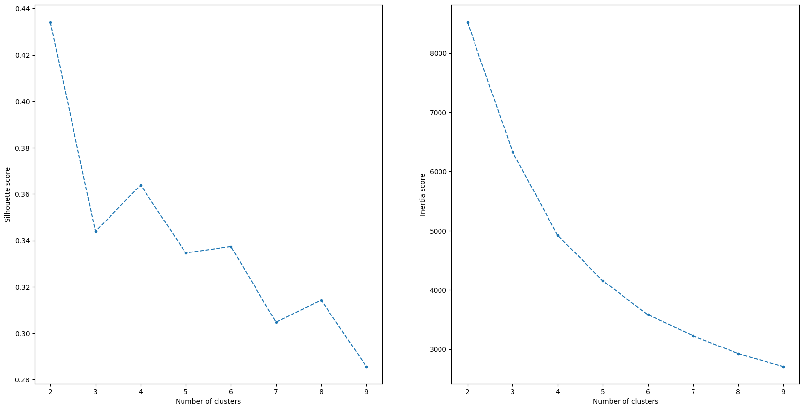

#### **TLDR**

The [Online Retail II](https://archive.ics.uci.edu/dataset/502/online+retail+ii) data set contains all the transactions occurring for a UK-based, registered, non-store online retail company between 01/12/2009 and 09/12/2011. They mainly sell unique all-occasion gift-ware.

Hence, I've attempted to conduct RFM (Recency, Frequency & Monetary) analysis and cluster their customers to come up with marketing strategy recommendations.

#### **Outcomes of clustering & recommendations**

| Cluster | Cluster Size | Recency | Monetary | Frequency |
| ------- | ------------ | ------- | -------- | --------- |
| 0       | 1534         | 234.98  | 1915.75  | 4.97      |
| 1       | 1228         | 27.37   | 10464.66 | 18.89     |
| 2       | 1168         | 28.09   | 837.08   | 3.07      |
| 3       | 1948         | 389.99  | 311.87   | 1.31      |

- `Cluster 1` seems to be best cluster although it is the 2nd smallest. This group spends more money and made the most transactions, and in average had their last transactions 27 days ago. These are the regular customers so loyalty programmes that encourage long-term patronage is a suitable campaign for them.

- `Cluster 0` is the next best cluster, because they make the 2nd most amount of money. However the customers in that group haven't come for a while. Hence, more targeted marketing efforts focused on building brand awareness and engagement is the recommendation for the long term. Over time, promotions e.g., free shipping or discounts can eventually be made to induce loyalty and patronage.

- `Cluster 2` can be characterised as those that spend less money, but order relatively frequently (as their last transactions a month ago). Promotions and discounts are likely to work well for this group to encourage them to spend more.

- Customers in `Cluster 3` have likely churned as they haven't spent much and haven't stopped by in a long time. This is worrisome as they make up the largest cluster.

#### **Methodology**

The RFM metrics were calculated as follows: 
- Recency: The number of days since the last purchase for each customer.
- Frequency: How often each customer makes a purchase.
- Monetary: The total amount of money each customer has spent.

After applying a logarithm transform (since all the metrics above were skewed to the right), we applied a Standard Scaler transformation to ensure uniform distribution between the variables. We finally used the elbow and silhouette method to find the optimal number of clusters. The K-Means algorithm was then used to cluster the customers by their RFM metrics.

#### **Future Recommendations**

- Future explorations can perhaps benefit from inspect if there's any meaningful differences between customers with an ID and those that don't. Analysis can be done on the types of products being bought, the number of items per purchase as well as their overall purchase value.
- The data set can benefit from greater data quality by ensuring that each Customer has an ID, as well as ensuring stricter procedures for logging negative quantity/price values. Both of which were prevalent in the data set. While we can make reasonable assumptions that these are return/cancelled items, perhaps a column marking that transaction as a return item (not just for cancelled ones) will be useful.